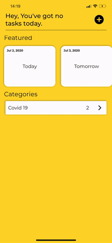

# TODO
Simple ToDo application written in Swift 5

## Supports

iOS 11+

## Pods Used

TODO uses number of open source dependencies for its magic 

* [RxSwift](https://github.com/ReactiveX/RxSwift)
* [RxCocoa](https://github.com/ReactiveX/RxSwift)
* [NotificationBannerSwift](https://github.com/Daltron/NotificationBanner)

## Contributing
Pull requests are welcome. For major changes, please open an issue first to discuss what you would like to change.

## License
[MIT](https://github.com/Koronaa/TODO/blob/master/LICENSE)

